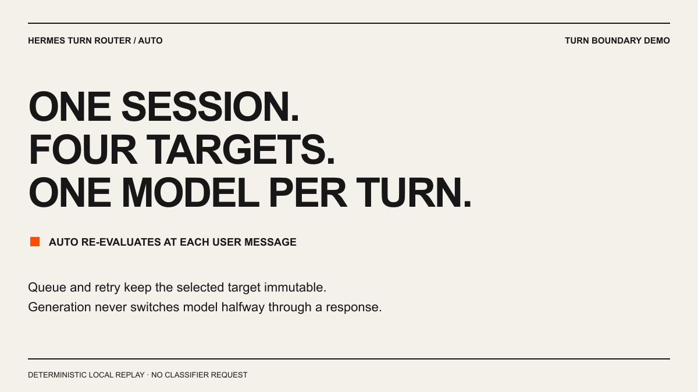
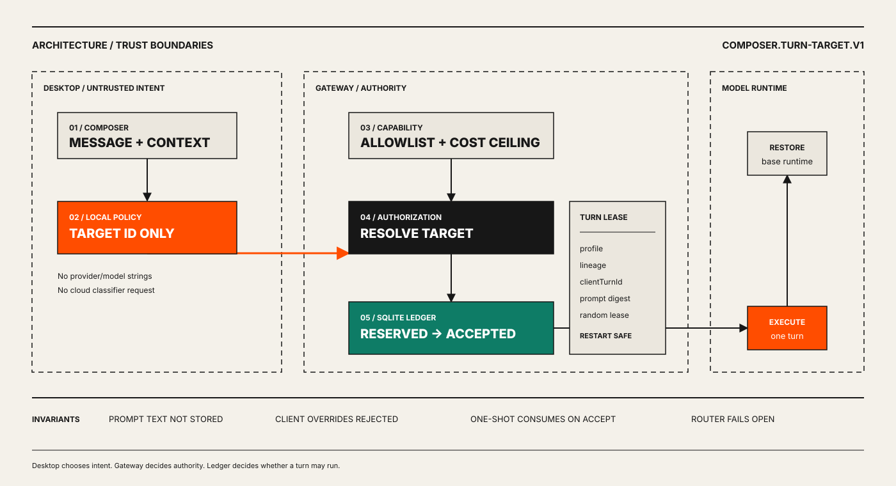
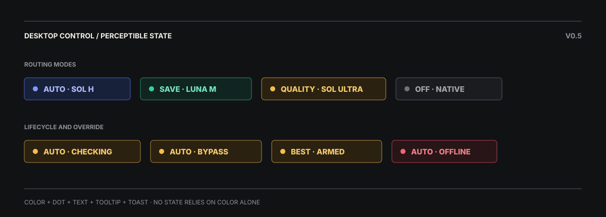

# Hermes Turn Router

[](https://github.com/Yueyue673/hermes-turn-router/releases/latest)
[](https://github.com/Yueyue673/hermes-turn-router/actions/workflows/ci.yml)
[](LICENSE)
[](package.json)
[](docs/compatibility.md)

A local, cache-aware, per-turn model router for [Hermes Agent](https://github.com/NousResearch/hermes-agent). It chooses an allowed target before each Desktop turn, keeps that decision stable through queue/retry/restart paths, and lets the Gateway—not the client—authorize the real provider, model, effort, and cost class.

**No classifier request. No global model mutation. No prompt text in the Router ledger.**

[中文](README.zh-CN.md) · [Getting started](docs/getting-started.md) · [Architecture](docs/architecture.md) · [Compatibility](docs/compatibility.md) · [Troubleshooting](docs/troubleshooting.md) · [Latest release](https://github.com/Yueyue673/hermes-turn-router/releases/latest)

> [!IMPORTANT]
> The policy engine and CLI are portable. The Hermes execution bridge is intentionally version-pinned and currently tested with Hermes Agent `0.20.5` at commit `2584b7c4eca82ada05f16eba08936d157b483329`. See the [compatibility matrix](docs/compatibility.md) before installing.

## See it route



The animation is generated from the real `routeMessage()` function: simple, technical, explicit-quality, and 360K-context cache-affinity turns, followed by the tested fail-open capability path. It contains no model-generated or hand-edited routing results.

## Why this exists

A fixed strong model wastes quota on routine turns. Naive per-turn switching can be worse: moving a large conversation to another model may discard the useful prompt-cache boundary and increase latency.

Hermes Turn Router makes the decision with four inputs that belong together:

- message signals and explicit mode;
- server-allowed targets and safety floor;
- the live model **and reasoning effort**;
- context size and switch/cache cost.

The incident below came from a real 691-message session. A simple explanatory turn was moved from Sol High to Luna; Luna processed roughly 388K uncached input tokens and took 30.8 seconds. Version 0.3 replays the same decision as `large_context_sticky`, keeps Sol High, and reports no switch/cache risk.


## What you get

| Layer | Behavior |
|---|---|
| Local policy | Synchronous TypeScript decision; no network or filesystem side effects |
| Four target tiers | Luna Medium, Sol Medium, Sol High, Sol Ultra in the reference policy |
| Cache stability | Auto mode holds established targets for 32K+ contexts instead of marginal downgrades |
| Explicit controls | Desktop `auto`, `save`, `quality`, `off`, plus `Best once` |
| Server authority | Client sends an opaque target ID; Gateway resolves provider/model/effort |
| Durable admission | SQLite lease ledger with reserved/accepted/completed states and conflict detection |
| Fail-open UX | Capability and policy/catalog mismatch warn and bypass; the Router never swallows the user's message |
| Truthful status | Desktop receives the model/effort actually serving the transient turn |
| Replay evaluation | Target distribution, switch rate, cache risk, expectation accuracy, usage and latency fields |
| Safe install | Commit/checksum preflight, ZIP backup, packaged Desktop staging, rollback |

## Quick start

### A. Try the policy engine

```bash
git clone https://github.com/Yueyue673/hermes-turn-router.git
cd hermes-turn-router
npm ci
npm run check
```

Inspect a real decision:

```bash
node dist/cli.js route \
  --text "Review this production migration carefully" \
  --allow fast,balanced,strong,premium \
  --context-tokens 24000 \
  --current-provider openai-codex \
  --current-model gpt-5.6-luna \
  --current-reasoning medium
```

```json
{
  "target": {
    "id": "balanced",
    "label": "Sol · Medium",
    "provider": "openai-codex",
    "model": "gpt-5.6-sol",
    "reasoningEffort": "medium"
  },
  "score": 45,
  "reasons": ["high_impact"],
  "switched": true,
  "contextPenalty": 6,
  "cacheRisk": "medium"
}
```

Replay the bundled anonymized fixture:

```bash
node dist/cli.js replay --input examples/replay.ndjson
```

The small smoke fixture contains six expected decisions. The larger [reference evaluation](docs/reference-evaluation.md) covers 32 bilingual and stateful events across ten categories: 31 checked decisions, 31 matches, one intentional `off` bypass, and zero routing errors.

### B. Install the Hermes bridge

Preflight first:

```bash
python integrations/hermes/scripts/install.py check \
  --hermes-source C:/path/to/hermes-agent \
  --hermes-home C:/path/to/hermes-home
```

Install source bridge, catalog, Desktop plugin, backup, and verification:

```bash
python integrations/hermes/scripts/install.py install \
  --hermes-source C:/path/to/hermes-agent \
  --hermes-home C:/path/to/hermes-home \
  --full-verify
```

For the tested Windows unpacked Desktop release, fully exit Hermes and add `--deploy-desktop`. Restart Hermes after installation, then choose `auto` beside the composer.

The complete procedure—including prerequisites, target catalog, packaged deployment, verification, and rollback—is in [Getting started](docs/getting-started.md).

## How a turn moves



1. Desktop scores the turn locally and sends only `targetId` plus reason metadata.
2. Gateway checks the profile catalog, cost ceiling, cross-provider policy, and approval requirement.
3. A SQLite lease reserves `(profile, lineage, clientTurnId)` with a server-computed prompt digest.
4. Gateway applies the authorized target. Exact targets are no-ops; effort-only changes avoid rebuilding the provider client.
5. One-shot state consumes only after explicit acceptance.
6. Queue, retry, and restart paths retain the same immutable decision.
7. Gateway completes the ledger row and restores the base runtime after the turn.

Read the full protocol in [Architecture](docs/architecture.md) and [Hermes integration](integrations/hermes/README.md).

## Reference target ladder

The bundled preset is an example, not a hard-coded provider dependency:

| ID | Reference target | Score | Intended work |
|---|---|---:|---|
| `fast` | Luna · Medium | `<25` | clear, low-risk, verifiable turns |
| `balanced` | Sol · Medium | `25–59` | analysis, code, multi-step execution |
| `strong` | Sol · High | `60–89` | higher-impact synthesis and review |
| `premium` | Sol · Ultra | `90+` | explicit quality, architecture, adversarial final review |

Targets are declared twice for separate trust roles:

- policy target: scoring metadata used by the local pure function;
- Gateway catalog target: server authority over provider/model/effort/cost.

Keep IDs aligned. The Gateway never trusts provider/model strings from Desktop.

## Desktop modes



The Composer control combines color, status dot, text, and tooltip feedback. Mode and lifecycle are always named explicitly, so checking, routing, bypass, offline, native-off, selected target, and one-shot armed states do not rely on color alone. Routine Router state never creates a dismissible toast or covers the conversation.

| Control | Meaning |
|---|---|
| `auto` | Re-evaluate each turn with safety, active target, context size, and cache cost |
| `save` | Apply a lower-cost bias directly while retaining the safety floor |
| `quality` | Apply a stronger-target bias directly |
| `off` | Leave selection to Hermes' native model picker—the fixed-model workflow |
| `Best once` | Arm the unique highest `quality_rank` authorized by Gateway for the next accepted turn; disable rather than guess when rank metadata is absent or ambiguous |

CLI/library users can still specify an explicit `fixed` target. Desktop does not duplicate Hermes' native model picker with a second fixed-mode UI.

## Library API

```ts
import { codexLunaSolPolicy, routeMessage } from 'hermes-turn-router'

const decision = routeMessage({
  text: 'Review this migration carefully',
  mode: 'auto',
  policy: codexLunaSolPolicy,
  allowedTargetIds: ['fast', 'balanced', 'strong', 'premium'],
  estimatedContextTokens: 24_000,
  state: {
    currentProvider: 'openai-codex',
    currentModel: 'gpt-5.6-luna',
    currentReasoningEffort: 'medium'
  }
})
```

`routeMessage()` is synchronous and side-effect free. Policies are JSON-schema validated and may use cloud providers, local endpoints, or mixed pools.

## Safety and privacy

- Router policy runs locally; no extra classifier receives the message.
- Gateway rejects client provider/model overrides.
- Catalog IDs are validated and bounded.
- High-impact signals enforce a configurable minimum tier.
- Approval tokens are short-lived HMAC tokens bound to profile, lineage, turn, target, and expiry.
- Ledger stores hashes and lifecycle metadata, not prompt or attachment content.
- Capability negotiation is bounded and fails open.
- Installer refuses unsupported commits, checksum mismatch, dirty worktrees, and unsafe patch application.

See [SECURITY.md](SECURITY.md) for the threat boundary and disclosure process.

## Compatibility

| Component | Current status |
|---|---|
| Policy/CLI | Node 20+, Windows/macOS/Linux |
| Hermes source bridge | commit `2584b7c4eca82ada05f16eba08936d157b483329` |
| Hermes version tested | `0.20.5` |
| Packaged Desktop deploy | Windows unpacked release tested |
| Other providers | Custom policy/catalog build path available; validate against the target profile |

Full matrix: [docs/compatibility.md](docs/compatibility.md).

## Known limits

- The Hermes bridge is not a stable upstream plugin API yet; it ships as a versioned patch plus external Desktop plugin.
- The reference router is explainable heuristic scoring, not a learned semantic classifier.
- Release bundles embed the tested Codex policy by default; custom providers require a matching local policy, Gateway catalog, and custom plugin build.
- Automatic feedback learning and interactive approval UI are not shipped.
- `requires_approval` targets are hidden by the default Desktop control until approval UX exists.
- macOS/Linux packaged Desktop deployment has not been verified.
- Provider transport stalls remain provider/network failures; the Router reduces avoidable switching and reports the serving model but does not duplicate a request after a stream has opened.

## Documentation

| Document | Use it for |
|---|---|
| [Getting started](docs/getting-started.md) | first install, verification, rollback |
| [Architecture](docs/architecture.md) | trust boundaries and turn lifecycle |
| [Hermes integration](integrations/hermes/README.md) | patch manifest and installer commands |
| [CLI reference](docs/cli.md) | validate, route, replay options |
| [Reference evaluation](docs/reference-evaluation.md) | generated category coverage and target distribution |
| [Providers](docs/providers.md) | custom policy/catalog validation and plugin builds |
| [Compatibility](docs/compatibility.md) | supported platforms and Hermes versions |
| [Troubleshooting](docs/troubleshooting.md) | Gateway, catalog, latency, installer failures |
| [Token economics](docs/token-economics.md) | cache risk and evaluation metrics |
| [Roadmap](docs/roadmap.md) | current scope and future work |

## Development

```bash
npm ci
npm run check
npm run render:assets
npm pack --dry-run
```

Routing changes should include a behavior test or an anonymized replay fixture. Integration changes should also prove clean install, Gateway/Desktop tests, packaged deployment where applicable, and rollback.

See [CONTRIBUTING.md](CONTRIBUTING.md), [Code of Conduct](CODE_OF_CONDUCT.md), and the [issue templates](.github/ISSUE_TEMPLATE/).

## Project status

Version `0.5.3` keeps all routine Router feedback inside the Composer and removes persistent dismissible toasts. It retains v0.5.2's Sol Ultra target and explicit Gateway `quality_rank` authority.

This is a community project and is not affiliated with Nous Research.

## License

MIT. See [LICENSE](LICENSE).
