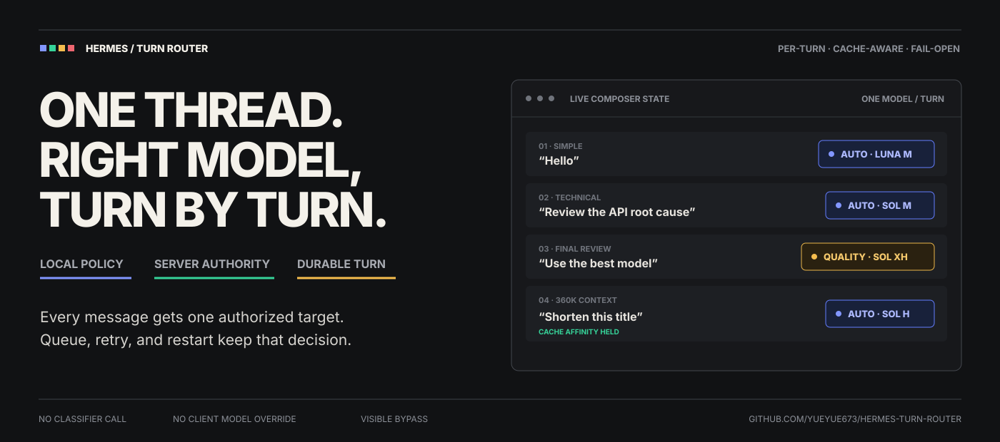
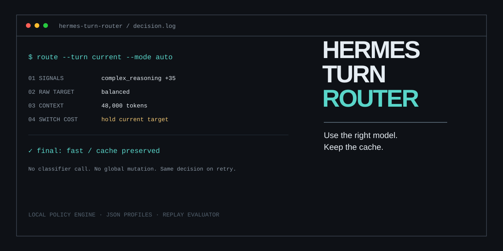

# Hermes Turn Router

[](https://github.com/Yueyue673/hermes-turn-router/actions/workflows/ci.yml)
[](LICENSE)
[](package.json)

Hermes Agent 的逐消息模型路由器。本地策略会读取当前消息、路由模式、上下文规模和可用 target，为这一轮选择模型，并让同一结果贯穿排队和重试。

[English](README.md) · [CLI](docs/cli.md) · [架构](docs/architecture.md) · [Hermes 集成](integrations/hermes/README.md)

## 功能

- 本地路由，不调用分类模型
- 自定义 provider、model、reasoning effort 和分数门槛
- `auto`、`save`、`quality`、`fixed` 和 one-shot 模式
- 长会话缓存滞回
- 高影响操作安全下限
- 服务端提供的 target allowlist
- JSON Schema 策略验证
- 单条路由检查和 NDJSON 批量回放
- 不包含消息正文的聚合回放报告
- 面向 Hermes 排队与重试链路的不可变 turn intent

## 快速开始

```bash
git clone https://github.com/Yueyue673/hermes-turn-router.git
cd hermes-turn-router
npm ci
npm run check
```

`npm run check` 会执行类型检查、测试、生产构建和 CLI 冒烟测试。

## CLI

### 验证策略

```bash
node dist/cli.js validate --policy presets/codex-luna-sol.json
```

```json
{
  "ok": true,
  "version": 1,
  "targets": ["fast", "balanced", "premium"]
}
```

### 查看一条消息的路由结果

```bash
node dist/cli.js route   --text "请认真检查这个生产迁移方案"   --allow fast,balanced,premium   --context-tokens 24000   --current-provider openai-codex   --current-model gpt-5.6-luna   --current-reasoning medium
```

```json
{
  "target": {
    "id": "premium",
    "provider": "openai-codex",
    "model": "gpt-5.6-sol",
    "reasoningEffort": "xhigh"
  },
  "reasons": ["explicit_quality", "high_impact", "complex_reasoning"],
  "switched": true,
  "contextPenalty": 6,
  "cacheRisk": "medium"
}
```

### 回放样本

```bash
node dist/cli.js replay --input examples/replay.ndjson
```

回放报告包含：

- 每个 target 的使用数量
- 模型切换次数和切换率
- 缓存风险分布
- 路由理由分布
- 期望 target 命中率
- 验证和路由错误

仓库内置六条样本，当前六条期望结果全部命中，错误数为零。



## 代码调用

```ts
import { codexLunaSolPolicy, routeMessage } from 'hermes-turn-router'

const decision = routeMessage({
  text: '认真检查这个迁移方案',
  mode: 'auto',
  policy: codexLunaSolPolicy,
  allowedTargetIds: ['fast', 'balanced', 'premium'],
  estimatedContextTokens: 24_000,
  state: {
    currentProvider: 'openai-codex',
    currentModel: 'gpt-5.6-luna',
    currentReasoningEffort: 'medium'
  }
})
```

`routeMessage()` 是同步纯函数，不访问网络和文件系统。

## 路由方式

策略文件包含一组有序 target 和若干加权信号。路由器先计算原始 target，再应用安全下限和切换成本。

`auto` 模式会根据上下文规模增加升降档门槛。`save`、`quality`、`fixed` 和 one-shot 按各自配置直接执行。

参考策略位于 [`presets/codex-luna-sol.json`](presets/codex-luna-sol.json)。同一结构可以配置其他云端 provider、本地模型或混合模型池。

```json
{
  "id": "balanced",
  "label": "Sol · Medium",
  "provider": "openai-codex",
  "model": "gpt-5.6-sol",
  "reasoningEffort": "medium",
  "minScore": 25
}
```

完整格式见 [`policy.schema.json`](policy.schema.json)。

## 模式

| 模式 | 行为 |
|---|---|
| `auto` | 综合消息信号、安全规则、当前 target 和切换成本。 |
| `save` | 增加低成本倾向，并保留安全下限。 |
| `quality` | 增加高能力 target 的倾向。 |
| `fixed` | 新 turn 使用指定的允许 target。 |
| `off` | 模型选择交给 Hermes。 |
| one-shot | 下一条成功接受的 turn 使用指定 target。 |

## Hermes 集成

策略核心和 CLI 可以独立运行。Desktop 自动路由还需要 Hermes 提供逐 turn 执行桥：

1. Desktop 生成稳定的 `clientTurnId`；
2. target 与消息一起提交；
3. Gateway 通过服务端 catalog 解析 target；
4. 排队和重试保留同一决策；
5. Gateway 临时应用模型，turn 结束后恢复原状态。

当前契约与测试矩阵：

- [`integrations/hermes/README.md`](integrations/hermes/README.md)
- [`docs/hermes-integration.md`](docs/hermes-integration.md)

Hermes 目前还没有把这条链路作为稳定的 Desktop 插件能力公开。下一版本会继续完成 Gateway target 授权、持久 turn ledger、能力协商和版本化安装。

## Token 与缓存

Prompt cache 通常与处理请求的 provider、model 和账号相关。切换模型后，目标模型可能需要重新处理会话前缀。路由器会把上下文规模纳入切换门槛，并在决策中返回缓存风险。

详细说明见 [`docs/token-economics.md`](docs/token-economics.md)。

## 开发

```bash
npm run check
npm run render:assets
npm pack --dry-run
```

调整路由策略时需要增加行为测试或脱敏回放样本。贡献规范见 [CONTRIBUTING.md](CONTRIBUTING.md)。

## 项目状态

`0.1.0` 包含策略核心、CLI、回放评估器、Schema、参考策略和 Hermes 集成契约。下一版本正在完善服务端授权、重启幂等、能力协商和安装更新流程。

版本记录见 [CHANGELOG.md](CHANGELOG.md)，计划见 [docs/roadmap.md](docs/roadmap.md)。

## License

MIT。社区项目，与 Nous Research 无官方隶属关系。
