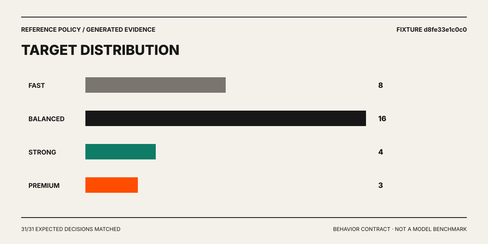

# Reference policy evaluation

This report is generated from [`examples/reference-evaluation.ndjson`](../examples/reference-evaluation.ndjson) using the bundled Codex Luna/Sol policy.

> [!NOTE]
> This is a deterministic behavior contract for the router, not a benchmark of model quality, provider latency, or real-world accuracy. Fixtures are public, anonymized, and intentionally selected to cover policy boundaries.

## Result

| Metric | Value |
|---|---:|
| Fixture events | 32 |
| Routed / bypassed | 31 / 1 |
| Expected decisions checked | 31 |
| Expected decisions matched | 31 |
| Expectation accuracy | 100% |
| Routing errors | 0 |
| Model switches | 1 |
| Switch rate | 3.2% |
| Fixture SHA-256 prefix | `d8fe33e1c0c0` |



## Coverage by category

| Category | Events | Matches | Accuracy |
|---|---:|---:|---:|
| `simple` | 4 | 4/4 | 100% |
| `technical` | 3 | 3/3 | 100% |
| `reasoning` | 3 | 3/3 | 100% |
| `safety` | 3 | 3/3 | 100% |
| `quality` | 4 | 4/4 | 100% |
| `modes` | 5 | 4/4 | 100% |
| `continuation` | 2 | 2/2 | 100% |
| `cache` | 4 | 4/4 | 100% |
| `authorization` | 2 | 2/2 | 100% |
| `observations` | 2 | 2/2 | 100% |

## Target distribution

| Target | Turns | Share of routed turns |
|---|---:|---:|
| `fast` | 8 | 25.8% |
| `balanced` | 16 | 51.6% |
| `premium` | 3 | 9.7% |
| `strong` | 4 | 12.9% |

## What the fixture covers

- short Chinese and English requests;
- technical/code messages and attachments;
- architecture and multi-constraint reasoning;
- production, database, permission, backup, and rollback safety floors;
- explicit quality and saving language;
- `auto`, `save`, `quality`, `fixed`, `off`, and one-shot behavior;
- continuation affinity;
- long-context cache affinity and safety upgrades;
- server allowlists;
- observed usage aggregation without prompt echoing.

## Reproduce

```bash
npm ci
npm run build
node dist/cli.js replay --input examples/reference-evaluation.ndjson
```

Regenerate this report and chart:

```bash
npm run evaluate:reference
```

CI runs the generator in `--check` mode and fails when policy behavior changes without an updated report. A threshold change must therefore update tests, fixtures, and this generated evidence in the same commit.
